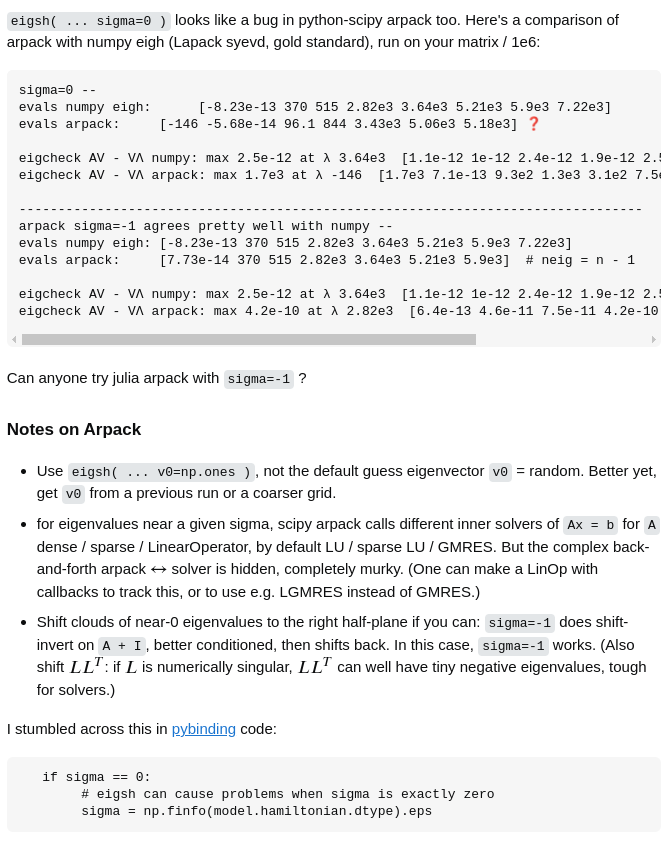

## Insights

1. ARPACK (used for computing eigenvalues of a sparse matrix in wanniertools. Note that this is also what scipy uses when you call eigsh) will lead to spurious eigenvalues and therefore spurious jumps in the bands. This seems to be a known issue as discussed in "[arpack-issues](https://scicomp.stackexchange.com/questions/36767/accuracy-issues-with-arpack-in-julia-for-eigenvalues-of-smallest-magnitude)"

   

The issue seems to stem from the fact that arpack is buggy when looking for eigenvalues around 0. So it is best to set the energy around which the eigenvalues need to be computed to a small non-zero value. In wannier tools, one can control this using the E_Fermi value in wt.in. Since wt.in sets it to 0 by default, remember to change it to 0.0001 for instance. In numpy, the way to fix the issue is to set the sigma parameter in eigsh to a similar small non-zero value.
